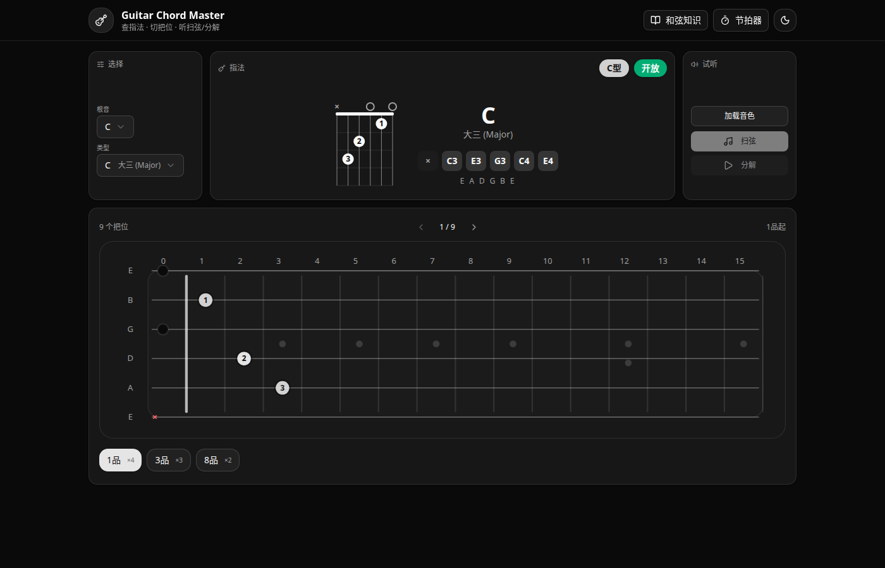

# Play Chords

一个**练习吉他和弦**的在线 Web 应用：选和弦、看指法、听扫弦/分解、配节拍器，把练习步骤尽量做到“打开就能练”。

- **在线体验（已上线）**：`https://rookiiie.top/play_chords`

## 预览截图



## 主要功能

- **和弦选择**：根音 + 常用和弦类型（major/minor/7/maj7/sus4 等）
- **指法图展示**：同一和弦支持多把位（Variant）切换
- **和弦试听**：扫弦（Strum）与分解（Arpeggio）两种示例播放
- **更逼真的音色**：SoundFont 采样钢弦吉他（支持本地离线加载）
- **节拍器**：BPM 40-240，固定 4/4，强弱拍区分，辅助节奏练习

## 技术栈

- **框架**：Next.js（App Router）+ React + TypeScript
- **样式**：Tailwind CSS
- **组件**：Shadcn UI + Lucide Icons
- **和弦数据**：`@tombatossals/chords-db`（指法/把位/MIDI）
- **指法图渲染**：`@tombatossals/react-chords`（SVG）
- **音频播放**：`soundfont-player`（SoundFont 采样）

## 本地开发

```bash
npm install
npm run dev
```

打开 `http://localhost:3000` 即可。

## 部署导航（给其他开发者）

### 你需要先知道的一点：`/play_chords` 路径

项目在**生产环境**默认使用 `basePath=/play_chords`（见 `next.config.ts`），因此推荐把它部署在类似 `https://your-domain.com/play_chords` 的路径下（与当前线上环境保持一致）。

### 推荐阅读顺序

- **一键部署（快速）**：`deploy/QUICKSTART.md`
- **完整部署文档（Nginx + PM2 + SSL + 回滚/排障）**：`deploy/README.md`
- **日常运维手册**：`deploy/OPERATIONS.md`

> 如果你希望部署在域名根路径（`/`）而不是 `/play_chords`，可以调整 `next.config.ts` 的 `basePath/assetPrefix` 策略，再配套修改你的反向代理路径。

## 目录结构（核心）

- `src/app/page.tsx`：主页面，整合选择器/指法图/播放控制
- `src/lib/chords.ts`：和弦数据访问层（key/suffix/positions）
- `src/components/ChordSelector.tsx`：根音/和弦类型选择
- `src/components/ChordDisplay.tsx`：指法图展示 + Variant 切换
- `src/components/PlaybackControls.tsx`：加载音色 + 播放扫弦/分解 + 节拍器控制
- `src/hooks/useAudio.ts`：音频引擎（SoundFont 加载与调度）
- `src/hooks/useMetronome.ts`：节拍器逻辑（Web Audio API 节拍生成）
- `public/soundfonts/`：本地 SoundFont 音源文件（离线/内网可用）

## 音色说明（SoundFont）

默认钢弦吉他音色为 `acoustic_guitar_steel`，优先本地加载 `public/soundfonts/` 下的资源，本地加载失败会回退到在线 SoundFont（便于开发调试/容灾）。

> 注意：SoundFont/采样音源可能涉及版权与再分发限制。若用于公开发布，请确认音色文件的许可证允许分发。

## 常用脚本

```bash
# 开发
npm run dev

# 构建 / 启动（生产）
npm run build
npm run start

# 自建服务器部署（配套 deploy/ 文档）
npm run deploy
```

## 常见问题

- **点击播放没声音**：浏览器需要用户手势才能启动音频；先点一次“加载真实钢弦吉他音色”，并检查是否静音/是否阻止自动播放。
- **音色加载慢/失败**：首次加载需要解码采样文件；网络受限时建议确保本地文件存在（`public/soundfonts/MusyngKite/acoustic_guitar_steel-mp3.js`）。

## 未来可扩展方向（Roadmap）

- **和弦搜索**：输入 `Cmaj7` / `F#m7` 自动解析为 `{ key, suffix }`
- **转调/变调夹**：按半音偏移映射根音并保持和弦类型
- **节拍器增强**：多拍号（3/4、6/8…）、更细节的节奏型、与和弦进行联动
